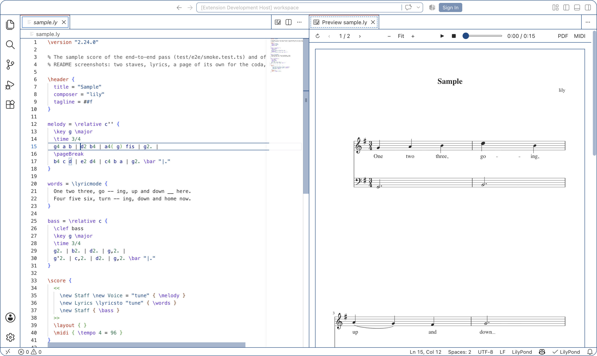
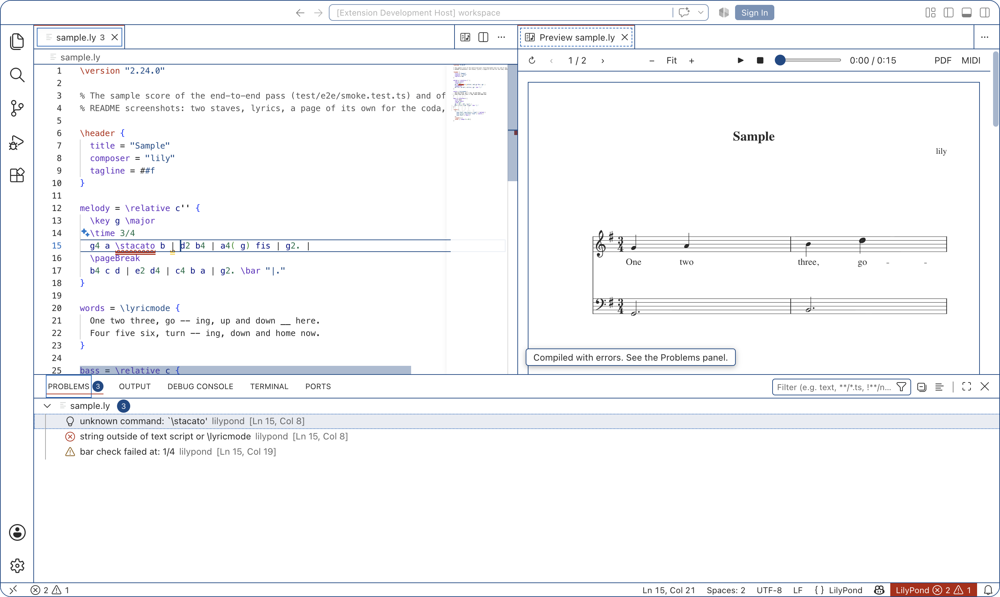
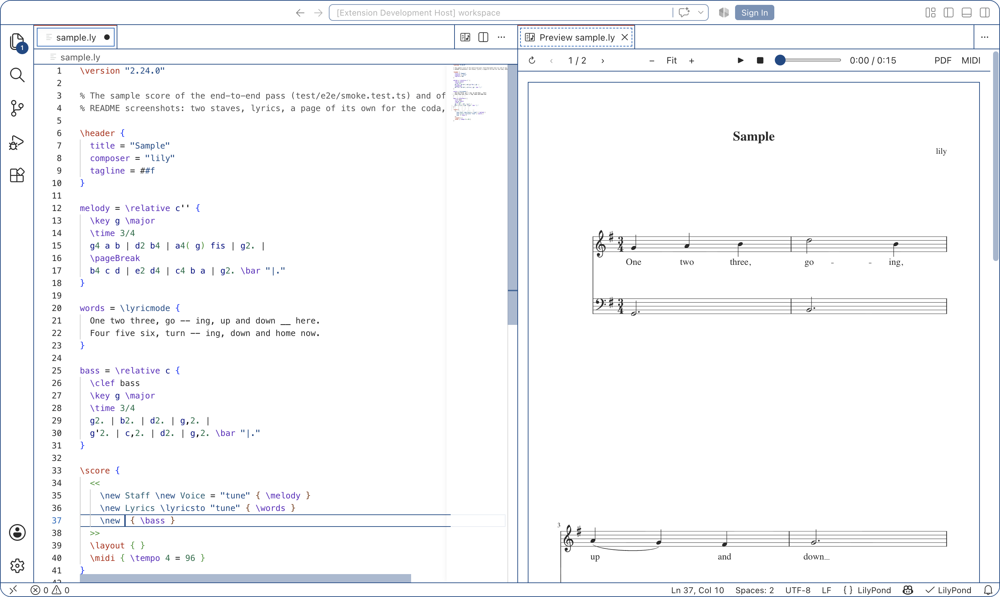

# Lily — LilyPond for VS Code

Write [LilyPond](https://lilypond.org) on the left, see the engraved score on the
right, and hear it. One extension, no dependencies on other extensions: syntax
highlighting, a live SVG preview, MIDI playback, errors in the Problems panel,
completion and hover for every LilyPond command, and a headless checker for
coding agents.



## Requirements

- VS Code 1.100 or newer.
- LilyPond 2.24 or newer, installed separately: `brew install lilypond`,
  `apt install lilypond`, or a download from
  [lilypond.org](https://lilypond.org/download.html). Lily finds it on `PATH`
  and in the usual install locations; otherwise set `lily.lilypond.path`.

Editing, highlighting, completion and hover work without LilyPond. Only
compiling needs it, and says so when it is missing.

## Getting started

1. Open a `.ly` file.
2. Press <kbd>Ctrl</kbd>+<kbd>K</kbd> <kbd>V</kbd> (<kbd>⌘K</kbd> <kbd>V</kbd>
   on macOS), or click the preview button in the editor title. The score opens
   in the pane beside the editor, and the editor keeps the focus.
3. Edit. The preview redraws, and keeps its zoom and scroll position.

## Features

### Side-by-side SVG preview

- Every page of the score, drawn as SVG: sharp at any zoom, and in the colours
  of your theme (or black on white, with `lily.preview.colors`).
- **Unsaved live preview.** Editing the root or a literal `\include` refreshes
  the score after a short pause. One compile finishes while the newest pending
  edit waits; continuous typing cannot keep postponing the preview. Editors are
  never saved automatically. Unchanged pages retain their DOM and navigation index.
- **Click a note** to jump to the place in the source that wrote it. **Move the
  cursor**, and the note it is on is marked in the score and scrolled into view.
- A toolbar in the preview: refresh, previous and next page, zoom out, fit to
  width, zoom in, play, and export to PDF or MIDI.
- Nothing is written next to your sources. Compiles happen in a temporary
  directory; PDF and MIDI files appear only when you export them.

### Playback

Give the score a `\midi { }` block and press ▶ in the preview (or
<kbd>Space</kbd> with the preview focused) to hear it. The music comes from the
same compile that drew the pages, so it is as fresh as the displayed revision, and an
edit that changes only the layout does not interrupt it. Pause, stop and seek
from the toolbar. The sound is a small built-in synthesizer: General MIDI
instruments (`midiInstrument`), drums, dynamics, tempo changes and pedalling
are all followed, well enough to check rhythm and harmony; there is no
SoundFont and nothing to install.

An exported `.midi` file, or any other, opens in a player of its own when you
click it in the Explorer, with its tracks and instruments listed. The
notification after **Export MIDI** offers *Play*.

VS Code lets a webview make sound only after you have clicked in it once. A
button in the toolbar counts; **Play or Pause MIDI** from the Command Palette
may ask you for that click the first time.

### Errors where they happen



The compile that draws the preview also reports LilyPond's errors and warnings:
as squiggles under the token LilyPond points at, in the Problems panel, and as
counts in the status bar. Messages about an included file land in that file.
The full log is in the **LilyPond** output channel (**LilyPond: Show Output**).
Open previews compile unsaved edits too. Diagnostics from an older editor
revision are discarded; editing clears obsolete squiggles in that document.

### Completion and hover



Generated from LilyPond itself (currently 2.26.0), not written by hand: about
750 commands with their signatures and documentation, and every context, layout
object and property.

| After | Lily offers |
| --- | --- |
| `\` | commands, music functions, markup commands, keywords |
| `\new`, `\context`, `\change` | contexts |
| `\override`, `\revert`, `\tweak`, `\hide`, `\omit` | layout objects, then after `Grob.` the properties of that object |
| `\set`, `\unset` | context properties |

Hover over a command, a context, a layout object or a property to read its
documentation. Snippets cover the usual skeletons: `\version`, `\score`,
`\relative`, `\new Staff`, `\new PianoStaff`, `\repeat volta`, `\tuplet`,
`\markup`, `define-music-function`, and `lily` for a whole file.

### Syntax highlighting

A grammar written for this extension: commands, pitches and durations,
articulations, strings, comments, lyrics and markup (where words are not
pitches), and embedded Scheme with balanced parentheses. `%` and `%{ %}` comments toggle with the usual
shortcuts, and `{ }` and `<< >>` close themselves.

### For coding agents (Codex and others)

The extension ships `dist/lily-check.js`, a command-line tool and
[MCP](https://modelcontextprotocol.io) server that runs the same compile and the
same error parser as the editor, and needs only Node.js:

```sh
node ~/.vscode/extensions/lily-dev.lily-0.1.0/dist/lily-check.js compile score.ly --json
node ~/.vscode/extensions/lily-dev.lily-0.1.0/dist/lily-check.js mcp    # tool: lilypond_compile
```

It prints one JSON report: `ok`, error and warning counts, each diagnostic with
its file, line, column, source line and offending token, and the paths of the
SVG pages. Exit code `0` compiled, `1` LilyPond reported errors, `2` LilyPond
did not run. [AGENTS.md](AGENTS.md) holds the compile-and-fix loop to give an
agent, and how to register the MCP server with Codex.

## Commands

All commands are in the Command Palette under **LilyPond**.

| Command | Default key | Also found |
| --- | --- | --- |
| Open Preview to the Side | <kbd>Ctrl/⌘</kbd>+<kbd>K</kbd> <kbd>V</kbd> | editor title, tab and Explorer context menus |
| Compile | <kbd>Ctrl/⌘</kbd>+<kbd>K</kbd> <kbd>B</kbd> | editor title `…` menu, status bar |
| Refresh Preview | <kbd>Ctrl/⌘</kbd>+<kbd>K</kbd> <kbd>B</kbd> in the preview | preview toolbar and title |
| Export PDF | | preview toolbar, editor title `…`, Explorer context menu |
| Export MIDI | | preview toolbar, editor title `…`, Explorer context menu |
| Play or Pause MIDI | <kbd>Space</kbd> in the preview | preview toolbar, editor title `…`, preview title `…` |
| Stop MIDI | | preview toolbar, preview title `…` |
| Zoom In Preview, Zoom Out Preview, Fit Preview to Width | | preview toolbar |
| Next Page in Preview, Previous Page in Preview | <kbd>Alt</kbd>+<kbd>PageDown</kbd>, <kbd>Alt</kbd>+<kbd>PageUp</kbd> in the preview | preview toolbar |
| Show Output | | preview title `…` menu |

**Export PDF** and **Export MIDI** write `name.pdf` and `name.midi` next to the
source, using an ordinary disk compile (the root is saved first). Dirty included
files remain unsaved; save them explicitly before exporting their changes. MIDI needs a `\midi { }` block in the score.

## Settings

| Setting | Default | |
| --- | --- | --- |
| `lily.lilypond.path` | `""` | Path to the `lilypond` executable, or to the directory that contains it. Empty: search `PATH` and the usual install locations. |
| `lily.compile.extraArgs` | `[]` | Extra arguments for every `lilypond` run, one per item, for example `--include=/path/to/library` or `-dno-point-and-click`. Can be set per folder. |
| `lily.preview.colors` | `"theme"` | `theme`: the score in the editor's foreground colour on its background. `paper`: black on white pages, whatever the theme. |
| `lily.preview.followCursor` | `true` | Mark the note the cursor is on in an open preview, and scroll to it. Clicking a note always goes to its source. |
| `lily.preview.refreshOnSave` | `true` | Enable automatic preview refreshes. When off, use **Compile** or **Refresh Preview**. |
| `lily.preview.refreshOnChange` | `true` | Also refresh unsaved edits. Turn off for save-only refreshes. Requires `refreshOnSave`. |
| `lily.preview.acceleration` | `"auto"` | Guarded glyph cache plus isolated warm compiler on supported macOS/Linux installations. `"cache"` starts a fresh process; `"off"` uses ordinary compilation. |
| `lily.preview.refreshDelay` | `150` | Milliseconds to coalesce edits/saves (0–5000). A burst starts a request within 750 ms, or this delay when longer. |

All settings take effect at once; nothing needs a reload. Completion and hover
follow VS Code's own switches, which can be set per language:

```json
"[lilypond]": { "editor.quickSuggestions": { "other": "off" }, "editor.hover.enabled": false }
```

## Good to know

- **Restricted Mode.** Compiling a `.ly` file runs the Scheme code inside it, so
  the extension is disabled in folders you have not trusted.
- **Other LilyPond extensions.** Lily brings its own grammar for the language id
  `lilypond`. With `lilypond-syntax` or VSLilyPond installed as well, two
  extensions answer for the same files, and which grammar wins is up to VS Code.
  Disable the others.
- **Included files.** Open the preview on the score, not on a part: editing the
  part then refreshes the score. A part previewed or compiled on its own is
  treated as a score, and usually engraves nothing.
- **Acceleration compatibility.** Enabled only for LilyPond 2.26.0 with the
  verified classic SVG backend file. Unknown/patched backends, custom compiler
  options other than include directories, and unsupported systems use ordinary
  processes. A failed warm process falls back automatically. No installed
  LilyPond files are changed. Set acceleration to `off` for Scheme that changes
  backend internals or unusual fonts. See [measurements and limits](docs/LIVE-PREVIEW-IMPLEMENTATION.md).
- **Snapshot limits.** Literal relative/absolute includes and `-I` directories
  are supported. Computed includes and known Scheme include APIs are rejected
  while buffers are dirty, with an explanation in the LilyPond output. Arbitrary
  Scheme file I/O and paths derived from source filenames are outside the
  snapshot model. Save those projects before compiling. Untitled files still
  need a filename. A failed preview keeps the last available pages/MIDI.
- **Windows** paths and process handling are written from documentation and have
  not been run yet.
- **Playback in the background.** The preview is destroyed while its tab is
  hidden behind another, and the music stops with it; keep the preview in a
  pane of its own, as **Open Preview to the Side** does.
- Not included: MIDI input, and code formatting.

## Development

```sh
npm install
npm run build          # esbuild → dist/
npm test               # types, lint, grammar snapshots, unit tests, extension-host tests
npm run test:e2e       # package the VSIX, unpack it, run a sample score through it
npm run vsix           # lily-<version>.vsix
npm run screenshots    # retake docs/images/*.png from the packaged extension
```

In the repository, `docs/ARCHITECTURE.md` explains the design and
`docs/DECISIONS.md` records why. Install a build with **Extensions: Install from
VSIX…** or `code --install-extension lily-0.1.0.vsix`.

## License

MIT; the text is in the `LICENSE` file. Nothing here is derived from VSLilyPond or `lilypond-syntax`,
which are CC BY-NC.
